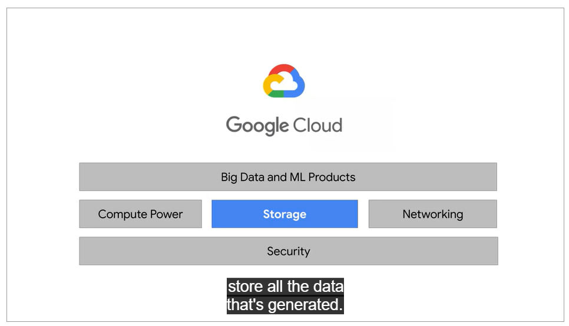
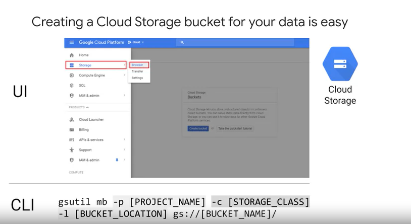
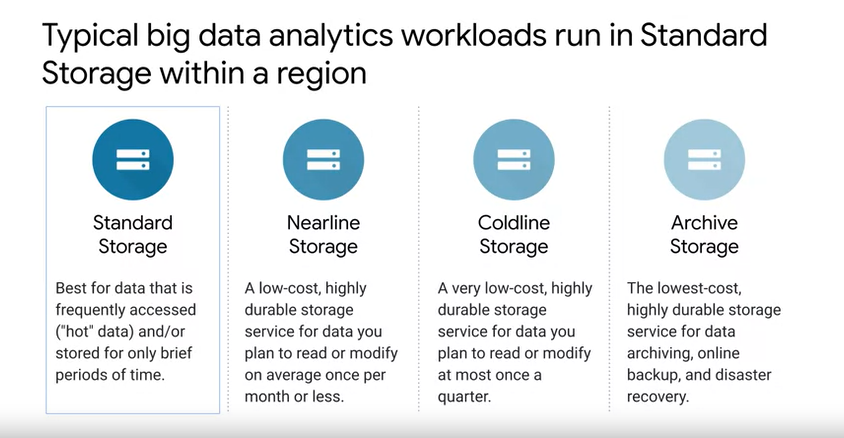
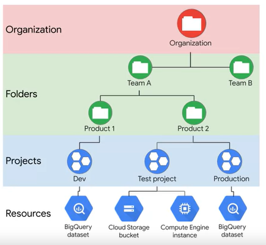
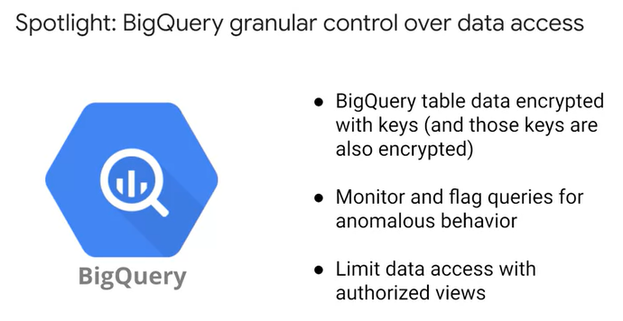
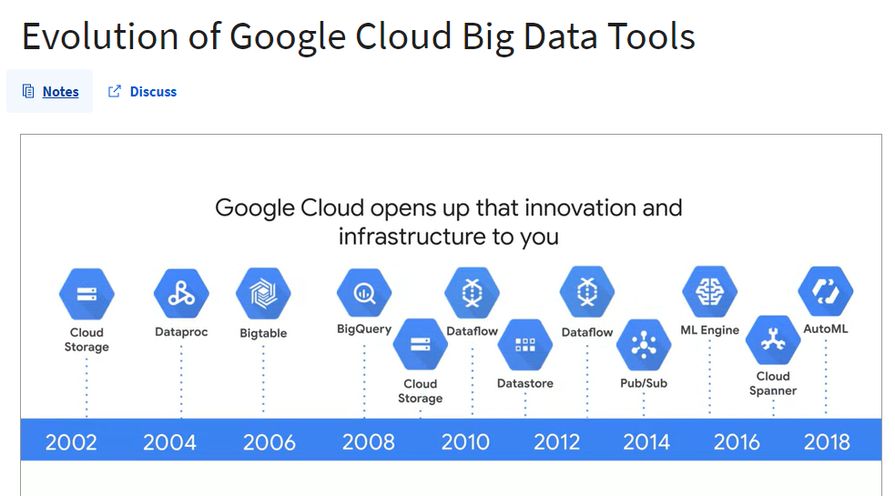

## leverage google's ai research with pre-trained ai building blocks

1. sight
   1. cloud vision
   1. cloud video intelligence
   1. auto ml vision
2. language
   1. cloud translation
   2. cloud natural language
   3. automl translation
   4. automl natural language
3. conversation
   1. dialogflow
   2. cloud text to speech
   3. cloud speech to text

## elastic storage with google cloud storage

* organization is a root node
* folder can have multiple projects; to use folder, you must have an organization
* projects can be created or deleted easily

## build on google's gloabl network

